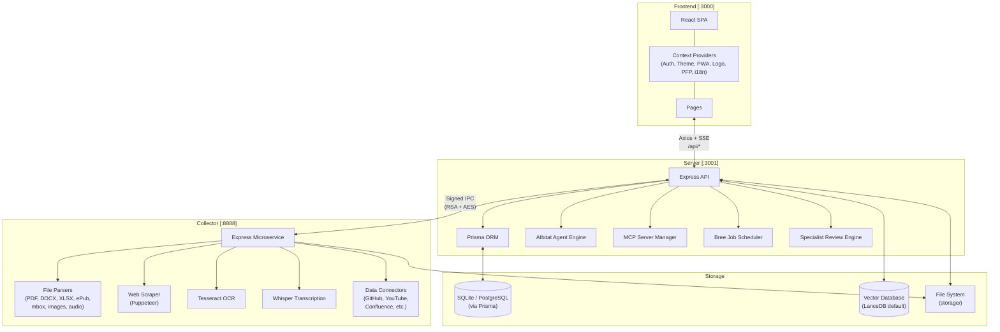
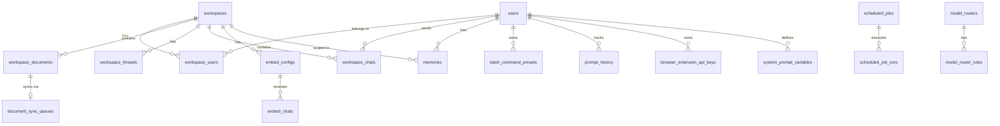
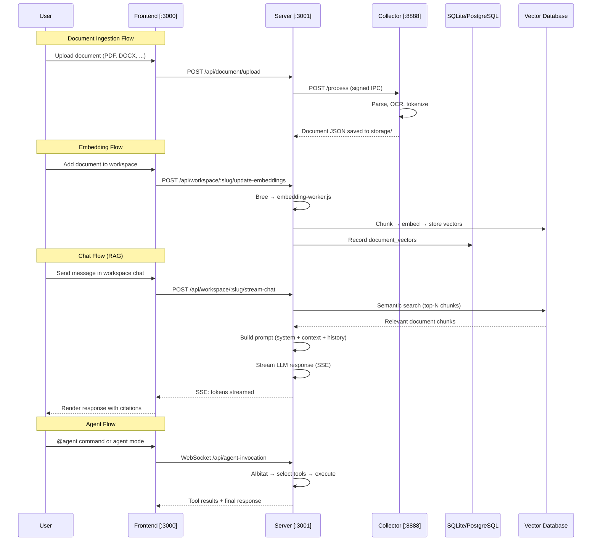

# Orion — Private Intelligence Platform

A self-hosted, air-gap-ready AI platform for private intelligence. Ingest documents of any format, embed them into vector databases, and chat with an LLM grounded in your data — all running on local hardware with zero external data egress.

Built on the AnythingLLM foundation by Mintplex Labs, transformed into Orion — a private intelligence platform with unified model routing, specialist AI review engine, deliverables registry, and security center.

> **Author:** Timothy Carambat (Mintplex Labs) · **License:** MIT

---

## Table of Contents

- [What This Project Does](#what-this-project-does)
- [Current Status](#current-status)
- [Key Features](#key-features)
- [Tech Stack](#tech-stack)
- [Architecture](#architecture)
- [Project Structure](#project-structure)
- [Frontend Routes & Pages](#frontend-routes--pages)
- [Server API Endpoints](#server-api-endpoints)
- [Database Schema](#database-schema)
- [Key Modules](#key-modules)
- [Supported Providers](#supported-providers)
- [Data Flow](#data-flow)
- [Setup & Installation](#setup--installation)
- [Environment Variables](#environment-variables)
- [Running the Project](#running-the-project)
- [CI/CD](#cicd)
- [Limitations](#limitations)
- [Future Scope](#future-scope)

---

## What This Project Does

Orion is a three-service monorepo that provides a complete private AI assistant:

1. **Collector** — A document ingestion microservice that parses PDFs, DOCX, XLSX, PPTX, ePub, emails (mbox), images (via OCR), audio/video (via Whisper), web pages, YouTube transcripts, GitHub/GitLab repos, Confluence, and more.
2. **Server** — An Express.js API that manages workspaces, users, vector embeddings, chat (with SSE streaming), agents with tool-calling, scheduled jobs, model routing, memories, and an encrypted SQLite database via Prisma ORM.
3. **Frontend** — A React SPA with a command-center dashboard, workspace chat interface, document manager, vector knowledge explorer, multi-perspective AI review engine, deliverables registry, and security center.

---

## Current Status

| Area | Status |
|------|--------|
| Document ingestion (20+ formats, OCR, Whisper) | ✅ Implemented |
| Multi-provider LLM chat with SSE streaming | ✅ Implemented |
| Vector embedding & RAG retrieval | ✅ Implemented |
| Workspace management with threads | ✅ Implemented |
| Agent system with tool-calling & skills | ✅ Implemented |
| Multi-user auth (JWT, roles, invites, SSO) | ✅ Implemented |
| Orion Dashboard (command center) | ✅ Implemented |
| Specialist AI Review Engine (4 perspectives) | ✅ Implemented |
| Deliverables Registry (DOCX/XLSX/PPTX/PDF/Code) | ✅ Implemented |
| Security Center (hardware vitals, audit logs) | ✅ Implemented |
| Scheduled jobs (cron-based agent tasks) | ✅ Implemented |
| Model routers (conditional routing rules) | ✅ Implemented |
| MCP server integration | ✅ Implemented |
| Telegram bot connector | ✅ Implemented |
| Embeddable chat widgets | ✅ Implemented |
| Internationalization (i18n) | ✅ Implemented |
| CI/CD (Docker build, lint, tests) | ✅ Implemented |
| Community Hub (import/export flows) | ✅ Implemented |
| Memory extraction (per-workspace) | ✅ Implemented |
| Browser extension API | ✅ Implemented |
| Mobile device connections | ✅ Implemented |

---

## Key Features

- **Zero-egress AI** — All inference, embeddings, and vector lookups can run entirely on local hardware (Ollama, LM Studio, local Whisper, LanceDB)
- **39+ LLM providers** — OpenAI, Anthropic, Gemini, Ollama, LM Studio, Groq, Mistral, DeepSeek, Bedrock, Azure, and many more
- **10 vector databases** — LanceDB (default, embedded), Chroma, Pinecone, Qdrant, Weaviate, Milvus, Zilliz, PGVector, Astra DB, Chroma Cloud
- **Universal document ingestion** — PDF, DOCX, XLSX, PPTX, ePub, mbox, CSV, JSON, Markdown, images (OCR via Tesseract), audio/video (Whisper transcription)
- **Data connectors** — GitHub, GitLab, Gitea, YouTube, Confluence, Obsidian Vault, Paperless-ngx, website depth crawling
- **Agent skills** — Web browsing, web scraping, SQL queries, file creation (DOCX/XLSX/PPTX/PDF), chart generation, Gmail, Google Calendar, Outlook, filesystem access, scheduled jobs, memory management
- **Multi-perspective AI Review** — 4-domain specialist engine (Technical, Policy/SOP, Risk, Final Decision) with conflict detection
- **Role-based access** — Admin, Manager, Default user roles with workspace-level permissions
- **Chat features** — SSE streaming, markdown rendering, KaTeX math, code syntax highlighting, citations with page numbers, inline charts (Recharts), slash commands, speech-to-text, text-to-speech
- **Embeddable widgets** — Deploy chat widgets on external sites with domain allowlists and rate limits
- **Secure IPC** — RSA-SHA256 signed communication between server and collector, AES-256-CBC encrypted credentials

---

## Tech Stack

| Layer | Technology |
|-------|-----------|
| **Frontend** | React 18, React Router v6, Tailwind CSS 3, Vite 4, Tremor (charts), Phosphor Icons |
| **UI Features** | Markdown-it, KaTeX, Highlight.js, Recharts, DOMPurify, react-beautiful-dnd, react-dropzone |
| **Speech** | Piper TTS (ONNX), Web Speech API (STT), ElevenLabs, OpenAI TTS/STT, Kokoro, Deepgram |
| **Server** | Node.js ≥18, Express 4, Prisma 5 (SQLite/PostgreSQL), JWT, bcryptjs, Winston logging |
| **AI/LLM** | LangChain 0.1, OpenAI SDK, Anthropic SDK, Ollama, 39 provider integrations |
| **Vector DBs** | LanceDB (default), Chroma, Pinecone, Qdrant, Weaviate, Milvus, Zilliz, PGVector, Astra |
| **Embeddings** | Native (Xenova/all-MiniLM-L6-v2), OpenAI, Ollama, Gemini, Cohere, VoyageAI, LiteLLM |
| **Collector** | Node.js, Express, Puppeteer, Tesseract.js (OCR), pdf-parse, mammoth, Sharp, Turndown |
| **Agents** | AIbitat framework, MCP SDK, tool-calling with approval flow, agent flow builder |
| **Background Jobs** | Bree (worker threads), cron scheduling, memory extraction, document sync |
| **CI/CD** | GitHub Actions (9 workflows), Docker multi-arch builds |
| **Dev Tools** | Nodemon, ESLint 9 (flat config), Prettier, Concurrently, VS Code launch configs |

---

## Architecture



---

## Project Structure

```
orion/
├── .github/
│   ├── FUNDING.yml
│   ├── ISSUE_TEMPLATE/
│   └── workflows/
│       ├── build-and-push-image.yaml      # Docker build on push to master
│       ├── build-and-push-image-semver.yaml # Docker build on release
│       ├── build-qa-tag.yaml              # QA test image for PRs
│       ├── cleanup-qa-tag.yaml            # Clean up QA images
│       ├── lint.yaml                      # ESLint across all 3 services
│       ├── run-tests.yaml                 # Backend test runner
│       ├── check-package-versions.yaml    # Shared dependency version check
│       ├── check-translations.yaml        # i18n locale validation
│       └── sponsors.yaml                  # Auto-update sponsors section
├── collector/                             # Document Ingestion Microservice
│   ├── index.js                           # Express entry (:8888)
│   ├── processSingleFile/                 # File-type converters
│   │   └── convert/                       # asPDF, asDocx, asXlsx, asEPub, asMbox, asImage, asAudio, ...
│   ├── processLink/                       # Web scraping & URL ingestion
│   ├── processRawText/                    # Raw text ingestion
│   ├── convertAudioToWav/                 # FFmpeg audio conversion
│   ├── extensions/                        # Data connectors (GitHub, YouTube, Confluence, ...)
│   ├── middleware/                         # Payload integrity verification, encryption
│   ├── hotdir/                            # Staging area for uploaded documents
│   ├── utils/
│   │   ├── OCRLoader/                     # Tesseract.js multi-threaded OCR
│   │   ├── WhisperProviders/              # Local Whisper, OpenAI, Generic
│   │   ├── EncryptionWorker/              # AES-256-CBC credential encryption
│   │   ├── comKey/                        # RSA-SHA256 IPC signature verification
│   │   ├── tokenizer/                     # cl100k_base token estimation
│   │   └── extensions/                    # Connector implementations
│   └── package.json
├── server/                                # Main API Server
│   ├── index.js                           # Express entry (:3001)
│   ├── endpoints/
│   │   ├── system.js                      # System settings, onboarding, branding
│   │   ├── workspaces.js                  # Workspace CRUD, embeddings, chat export
│   │   ├── workspaceThreads.js            # Multi-thread conversations
│   │   ├── chat.js                        # SSE streaming chat
│   │   ├── admin.js                       # User/workspace/system administration
│   │   ├── review.js                      # Specialist AI Review Engine
│   │   ├── deliverables.js                # Generated file registry
│   │   ├── security.js                    # Hardware vitals & audit logs
│   │   ├── document.js                    # Document management
│   │   ├── agentWebsocket.js              # Agent WebSocket communication
│   │   ├── agentFlows.js                  # Agent flow builder
│   │   ├── agentSkillWhitelist.js         # Agent skill permissions
│   │   ├── agentFileServer.js             # Agent-generated file serving
│   │   ├── mcpServers.js                  # MCP server management
│   │   ├── memory.js                      # Workspace memories CRUD
│   │   ├── modelRouter.js                 # Conditional model routing
│   │   ├── scheduledJobs.js               # Cron job management
│   │   ├── telegram.js                    # Telegram bot connector
│   │   ├── invite.js                      # User invitations
│   │   ├── embed/                         # Embeddable chat widget API
│   │   ├── embedManagement.js             # Widget configuration
│   │   ├── browserExtension.js            # Browser extension API
│   │   ├── communityHub.js                # Community hub import/export
│   │   ├── webPush.js                     # Web push notifications
│   │   ├── experimental/                  # Beta features (live doc sync)
│   │   └── api/                           # Developer API (API key auth)
│   ├── models/                            # 35 Prisma model wrappers
│   ├── prisma/
│   │   ├── schema.prisma                  # Database schema (30+ tables)
│   │   ├── migrations/                    # Schema migration history
│   │   └── seed.js                        # Database seeder
│   ├── jobs/                              # Bree background workers
│   │   ├── embedding-worker.js            # Async vector embedding
│   │   ├── extract-memories.js            # Automatic memory extraction
│   │   ├── run-scheduled-job.js           # Scheduled agent job runner
│   │   ├── sync-watched-documents.js      # Live document resync
│   │   ├── handle-telegram-chat.js        # Telegram message processor
│   │   └── cleanup-*.js                   # Generated file cleanup
│   ├── utils/
│   │   ├── AiProviders/                   # 39 LLM provider integrations
│   │   ├── EmbeddingEngines/              # 14 embedding provider integrations
│   │   ├── vectorDbProviders/             # 10 vector database integrations
│   │   ├── agents/                        # AIbitat agent framework + skills
│   │   │   └── aibitat/plugins/           # Agent skills (web browse, SQL, file creation, ...)
│   │   ├── agentFlows/                    # Agent flow execution engine
│   │   ├── MCP/                           # Model Context Protocol client
│   │   ├── EncryptionManager/             # AES-256-GCM encryption at rest
│   │   ├── DocumentManager/               # Document storage management
│   │   ├── TextSplitter/                  # Configurable text chunking
│   │   ├── TextToSpeech/                  # TTS providers (native, OpenAI, ElevenLabs, Kokoro)
│   │   ├── SpeechToText/                  # STT providers (native, OpenAI, Deepgram, Groq)
│   │   ├── ImageGenerators/               # Image generation (OpenAI, Ollama, OpenRouter)
│   │   ├── EmbeddingRerankers/            # Embedding reranking for agent tool selection
│   │   ├── BackgroundWorkers/             # Worker thread management
│   │   ├── middleware/                    # Auth, multi-user protection, rate limiting
│   │   ├── telegramBot/                   # Telegram bot runtime
│   │   └── vectorStore/                   # Vector store abstraction layer
│   ├── storage/                           # Runtime data (DB, vectors, documents)
│   └── package.json
├── frontend/                              # React Single-Page Application
│   ├── src/
│   │   ├── main.jsx                       # Router definitions (50+ routes, lazy-loaded)
│   │   ├── App.jsx                        # Root wrapper (ErrorBoundary, context providers)
│   │   ├── AuthContext.jsx                # JWT auth state (login, logout, session validation)
│   │   ├── ThemeContext.jsx               # Dark/light theme
│   │   ├── PWAContext.jsx                 # Progressive Web App mode
│   │   ├── LogoContext.jsx                # Custom branding logo
│   │   ├── PfpContext.jsx                 # Profile picture provider
│   │   ├── i18n.js                        # Internationalization setup
│   │   ├── pages/
│   │   │   ├── Dashboard/                 # Sovereign AI Command Center
│   │   │   ├── WorkspaceChat/             # Main chat interface
│   │   │   ├── WorkspaceSettings/         # Workspace configuration (5 tabs)
│   │   │   ├── Documents/                 # Document repository & upload
│   │   │   ├── Knowledge/                 # Vector DB & semantic search explorer
│   │   │   ├── Review/                    # Multi-perspective AI review
│   │   │   ├── Deliverables/              # Generated artifacts registry
│   │   │   ├── Security/                  # Security center & audit logs
│   │   │   ├── Admin/                     # Admin pages (users, agents, logs, ...)
│   │   │   ├── GeneralSettings/           # System settings (LLM, embeddings, vector DB, ...)
│   │   │   ├── Login/                     # Authentication (multi-user, SSO)
│   │   │   ├── OnboardingFlow/            # Multi-step setup wizard
│   │   │   └── 404.jsx                    # Not found page
│   │   ├── components/
│   │   │   ├── Sidebar/                   # Main navigation sidebar
│   │   │   ├── WorkspaceChat/             # Chat container, prompt input, history
│   │   │   ├── PrivateRoute/              # Route guards (Private, Manager, Admin, SingleUser)
│   │   │   ├── SettingsSidebar/           # Settings navigation menu
│   │   │   ├── LLMSelection/             # LLM provider picker
│   │   │   ├── EmbeddingSelection/        # Embedding provider picker
│   │   │   ├── VectorDBSelection/         # Vector DB picker
│   │   │   ├── Modals/                    # Workspace management, password, recovery codes
│   │   │   ├── UserMenu/                  # User profile & logout
│   │   │   ├── SpeechToText/              # Web Speech API integration
│   │   │   ├── TextToSpeech/              # Client-side TTS (Piper ONNX)
│   │   │   └── ...                        # 28 component directories total
│   │   ├── models/                        # API service layer (27 modules)
│   │   ├── hooks/                         # 25 custom React hooks
│   │   ├── utils/                         # Helpers, paths, constants
│   │   └── locales/                       # i18n translation files
│   ├── vite.config.js                     # Dev port 3000, WASM inlining, path aliases
│   ├── tailwind.config.js                 # Dark mode, CSS variable theme, Tremor integration
│   └── package.json
├── eslint.config.js                       # Shared ESLint 9 flat config
├── package.json                           # Root monorepo scripts
└── .gitignore
```

---

## Frontend Routes & Pages

### Core Application Routes

| Route | Page | Guard | Purpose |
|-------|------|-------|---------|
| `/` | Dashboard | Private | Sovereign AI Command Center — system status, workspace overview, zero-egress metrics |
| `/dashboard` | Dashboard | Private | Alias for command center |
| `/workspace` | WorkspaceChat | Private | Chat interface (last visited workspace) |
| `/workspace/:slug` | WorkspaceChat | Private | Specific workspace chat |
| `/workspace/:slug/t/:threadSlug` | WorkspaceChat | Private | Multi-threaded workspace conversation |
| `/workspace/:slug/settings/:tab` | WorkspaceSettings | Manager | Workspace config (appearance, chat, vector DB, members, agent) |
| `/documents` | Documents | Private | Document repository — upload, search, embed into workspaces |
| `/knowledge` | Knowledge | Private | Vector DB explorer — semantic retrieval testing, similarity scoring |
| `/review` or `/ai-review` | Review | Private | Multi-perspective specialist AI review (Technical, Policy, Risk, Final) |
| `/deliverables` | Deliverables | Private | Registry of agent-generated files (DOCX, XLSX, PPTX, PDF, Code) |
| `/security` or `/security-center` | Security | Private | Hardware vitals, memory usage, AES-256 encryption status, audit logs |
| `/login` | Login | Public | Authentication (password, multi-user, SSO) |
| `/sso/simple` | SimpleSSOPassthrough | Public | Simple SSO redirect handler |
| `/accept-invite/:code` | Invite | Public | Token-based invite redemption |
| `/onboarding` | OnboardingFlow | Public | Multi-step setup wizard (LLM, embedding, vector DB, user setup) |
| `*` | 404 | Public | Not found |

### Admin & Settings Routes (30+ routes)

| Route Pattern | Guard | Purpose |
|---------------|-------|---------|
| `/settings/llm-preference` | Admin | LLM provider selection & configuration |
| `/settings/embedding-preference` | Admin | Embedding engine selection |
| `/settings/vector-database` | Admin | Vector database selection |
| `/settings/transcription-preference` | Admin | Whisper/transcription provider |
| `/settings/audio-preference` | Admin | TTS/STT provider configuration |
| `/settings/image-generation-preference` | Admin | Image generation provider |
| `/settings/text-splitter-preference` | Admin | Text chunking strategy |
| `/settings/agents` | Admin | Agent configuration |
| `/settings/agents/builder(/:flowId)` | Admin | Visual agent flow builder |
| `/settings/model-routers(/:id)` | Admin | Conditional model routing rules |
| `/settings/system-prompt-variables` | Admin | Dynamic system prompt variables |
| `/settings/default-system-prompt` | Admin | Default workspace system prompt |
| `/settings/api-keys` | Admin | Developer API key management |
| `/settings/embed-chat-widgets` | Admin | Embeddable chat widget management |
| `/settings/event-logs` | Admin | System event log viewer |
| `/settings/privacy` | Admin | Privacy & data handling settings |
| `/settings/beta-features` | Admin | Experimental features toggle |
| `/settings/external-connections/telegram` | Admin | Telegram bot setup |
| `/settings/scheduled-jobs(/:id/runs)` | SingleUser | Cron-based scheduled agent jobs |
| `/settings/security` | Manager | Security settings |
| `/settings/interface` | Manager | UI customization |
| `/settings/branding` | Manager | Custom logo and branding |
| `/settings/chat` | Manager | Chat behavior settings |
| `/settings/workspace-chats` | Manager | Chat history viewer |
| `/settings/users` | Manager | User management |
| `/settings/workspaces` | Manager | Workspace management |
| `/settings/invites` | Manager | Invitation codes |
| `/settings/browser-extension` | Manager | Browser extension API key |

### Route Protection

| Guard | Requirement |
|-------|-------------|
| **Private** | Any authenticated session (single-user or multi-user) |
| **Manager** | Role = `admin` or `manager` (bypassed in single-user mode) |
| **Admin** | Role = `admin` (bypassed in single-user mode) |
| **SingleUser** | Only when multi-user mode is disabled |

---

## Server API Endpoints

The server mounts **30+ endpoint modules** under `/api`. Key groups:

| Module | Base Path | Purpose |
|--------|-----------|---------|
| `system` | `/api/system/*` | Onboarding, settings, branding, telemetry, file exploration, health checks |
| `workspaces` | `/api/workspace/*` | CRUD, embedding management, chat (SSE streaming), suggested messages, PDF export |
| `workspaceThreads` | `/api/workspace/:slug/thread/*` | Multi-thread conversations within workspaces |
| `chat` | `/api/workspace/:slug/stream-chat` | Real-time SSE streaming chat |
| `admin` | `/api/admin/*` | User CRUD, system preferences, workspace administration |
| `review` | `/api/review/*` | Run specialist review, fetch history |
| `deliverables` | `/api/deliverables` | List agent-generated files |
| `security` | `/api/security/status` | Hardware vitals, memory usage, audit logs |
| `document` | `/api/document/*` | Document metadata management |
| `agentWebsocket` | WebSocket `/api/agent-invocation/*` | Agent tool-calling via WebSocket |
| `agentFlows` | `/api/agent-flows/*` | Agent flow CRUD and execution |
| `agentSkillWhitelist` | `/api/agent-skills/*` | Skill permission management |
| `agentFileServer` | `/api/agent-skills/generated-files/*` | Serve agent-generated file downloads |
| `mcpServers` | `/api/mcp-servers/*` | MCP server registration and management |
| `memory` | `/api/workspace/:slug/memory/*` | Per-workspace memory CRUD |
| `modelRouter` | `/api/model-router/*` | Conditional routing rules between LLM providers |
| `scheduledJobs` | `/api/scheduled-jobs/*` | Cron-based agent job scheduling, run history |
| `telegram` | `/api/telegram/*` | Telegram bot configuration and management |
| `invite` | `/api/invite/*` | Invitation code management |
| `embed` | `/api/embed/*` | Embeddable chat widget public API |
| `embedManagement` | `/api/embed-config/*` | Widget configuration management |
| `browserExtension` | `/api/browser-extension/*` | Browser extension API |
| `experimental` | `/api/experimental/*` | Beta features (live document sync) |
| `api` (developer) | `/api/v1/*` | Public developer API (API key auth) |
| `webPush` | `/api/web-push/*` | Web push notification subscriptions |
| `utils` | `/api/utils/*` | Utility endpoints |

---

## Database Schema

The database uses **Prisma ORM** with **SQLite** by default (switchable to PostgreSQL). Key tables:



**30+ tables** including: `users`, `workspaces`, `workspace_documents`, `workspace_chats`, `workspace_threads`, `workspace_users`, `document_vectors`, `embed_configs`, `embed_chats`, `event_logs`, `api_keys`, `invites`, `system_settings`, `cache_data`, `recovery_codes`, `password_reset_tokens`, `slash_command_presets`, `document_sync_queues`, `document_sync_executions`, `browser_extension_api_keys`, `temporary_auth_tokens`, `system_prompt_variables`, `prompt_history`, `workspace_parsed_files`, `external_communication_connectors`, `scheduled_jobs`, `scheduled_job_runs`, `memories`, `model_routers`, `model_router_rules`, `workspace_agent_invocations`, `workspace_suggested_messages`.

---

## Key Modules

### Agent System (`server/utils/agents/`)

The **AIbitat** agent framework provides tool-calling capabilities:

| Skill | Description |
|-------|-------------|
| `web-browsing.js` | Full web browsing with search engine integration (Google, Bing, SerpAPI, Tavily, etc.) |
| `web-scraping.js` | Scrape and extract content from URLs |
| `sql-agent/` | Query SQL databases (PostgreSQL, MySQL, MSSQL) |
| `create-files/` | Generate DOCX, XLSX, PPTX, PDF documents |
| `filesystem/` | Read/write files on the host system |
| `gmail/` | Read and send Gmail messages |
| `google-calendar/` | Google Calendar event management |
| `outlook/` | Microsoft Outlook integration |
| `rechart.js` | Generate data visualizations (chart.js → PNG) |
| `memory.js` | Store and recall workspace memories |
| `summarize.js` | Summarize document content |
| `chat-history.js` | Access past conversation history |
| `create-scheduled-job/` | Create cron-based scheduled agent tasks |
| `cli.js` | Execute CLI commands |
| `request-user-input.js` | Pause agent execution to ask user for input |

### Background Workers (`server/jobs/`)

| Job | Purpose |
|-----|---------|
| `embedding-worker.js` | Async document vector embedding |
| `extract-memories.js` | Automatic memory extraction from chat history |
| `run-scheduled-job.js` | Execute scheduled cron agent tasks |
| `sync-watched-documents.js` | Re-sync live document sources |
| `handle-telegram-chat.js` | Process incoming Telegram messages |
| `cleanup-generated-files.js` | Clean up old agent-generated files |
| `cleanup-generated-images.js` | Clean up old generated images |
| `cleanup-orphan-documents.js` | Remove orphaned document records |

### Collector Connectors (`collector/extensions/`)

| Connector | Source |
|-----------|--------|
| GitHub / GitLab / Gitea | Repository files, issues, wiki pages |
| YouTube | Video transcripts + metadata |
| Confluence | Cloud & Server/Data Center pages |
| DrupalWiki | Spaces, pages, attachments |
| Obsidian Vault | Local markdown vaults |
| Paperless-ngx | OCR'd document archive |
| Website Depth | Recursive site crawling |

---

## Supported Providers

### LLM Providers (39)

OpenAI, Anthropic, Gemini, Azure OpenAI, Ollama, LM Studio, Groq, Mistral, DeepSeek, OpenRouter, Together AI, Fireworks AI, Perplexity, KoboldCPP, Text Generation WebUI, LocalAI, LiteLLM, Cohere, AWS Bedrock, APIPie, xAI (Grok), NVIDIA NIM, PPIO, Moonshot AI, SambaNova, Cerebras, NovitaAI, Docker Model Runner, Private Mode, Lemonade, MiniMax, OMLX, Foundry, Gitee AI, CometAPI, Zai, Generic OpenAI, Model Router

### Embedding Engines (14)

Native (Xenova/all-MiniLM-L6-v2), OpenAI, Azure OpenAI, Ollama, LM Studio, LocalAI, Cohere, VoyageAI, LiteLLM, Gemini, OpenRouter, Mistral, Generic OpenAI, Lemonade

### Vector Databases (10)

LanceDB (default, embedded), Chroma, Chroma Cloud, Pinecone, Qdrant, Weaviate, Milvus, Zilliz Cloud, PGVector, Astra DB

---

## Data Flow



---

## Setup & Installation

### Prerequisites

- **Node.js** ≥ 18.12.1
- **npm** or **yarn**
- **Git**
- *Optional:* Chromium (for Puppeteer web scraping), FFmpeg (for audio processing)

### 1. Clone the Repository

```bash
git clone https://github.com/sooubh/orion.git
cd orion
```

### 2. Install Dependencies

```bash
# Install root dependencies
npm install

# Install all sub-project dependencies
cd server && npm install && cd ..
cd collector && npm install && cd ..
cd frontend && npm install && cd ..
```

### 3. Set Up the Database

```bash
npm run setup
# This runs: prisma:generate + prisma:migrate
```

### 4. Configure Environment Variables

```bash
cp server/.env.example server/.env
cp collector/.env.example collector/.env
```

Edit `server/.env` with your configuration (see [Environment Variables](#environment-variables)).

---

## Environment Variables

### Server (`server/.env`)

| Variable | Required | Default | Description |
|----------|:--------:|---------|-------------|
| `SERVER_PORT` | No | `3001` | API server port |
| `JWT_SECRET` | **Yes** | — | JWT signing secret (min 12 chars) |
| `SIG_KEY` | **Yes** | — | IPC signature passphrase (min 32 chars) |
| `SIG_SALT` | **Yes** | — | IPC signature salt (min 32 chars) |
| `LLM_PROVIDER` | No | — | LLM provider (e.g. `openai`, `ollama`, `anthropic`, `gemini`) |
| `EMBEDDING_ENGINE` | No | `native` | Embedding engine (e.g. `native`, `openai`, `ollama`) |
| `VECTOR_DB` | No | `lancedb` | Vector database (e.g. `lancedb`, `chroma`, `pinecone`) |
| `WHISPER_PROVIDER` | No | `local` | Transcription provider |
| `TTS_PROVIDER` | No | `native` | Text-to-speech provider |
| `STT_PROVIDER` | No | `native` | Speech-to-text provider |
| `STORAGE_DIR` | No | `server/storage/` | Data storage directory |
| `AUTH_TOKEN` | No | — | Single-user password for remote deployment |
| `ENABLE_HTTPS` | No | — | Enable HTTPS with `HTTPS_CERT_PATH` and `HTTPS_KEY_PATH` |
| `NODE_ENV` | No | `production` | Environment mode |

Provider-specific keys (e.g. `OPEN_AI_KEY`, `ANTHROPIC_API_KEY`, `OLLAMA_BASE_PATH`) — see [`.env.example`](server/.env.example) for the full list of 150+ configuration options.

### Collector (`collector/.env`)

| Variable | Required | Default | Description |
|----------|:--------:|---------|-------------|
| `COLLECTOR_PORT` | No | `8888` | Collector service port |

### Frontend

| Variable | Default | Description |
|----------|---------|-------------|
| `VITE_API_BASE` | `/api` (production) or `http://localhost:3001/api` (dev) | API endpoint URL |

---

## Running the Project

### Development (all 3 services)

```bash
npm run dev
```

This uses `concurrently` to start:
- **Frontend** on `http://localhost:3000`
- **Server** on `http://localhost:3001`
- **Collector** on `http://localhost:8888`

### Run Individually

```bash
npm run dev:frontend    # Frontend only (Vite)
npm run dev:server      # Server only (nodemon)
npm run dev:collector   # Collector only (nodemon)
```

### Database Commands

```bash
npm run prisma:generate   # Generate Prisma client
npm run prisma:migrate    # Apply migrations
npm run prisma:seed       # Seed initial data
npm run setup             # Generate + migrate (first-time setup)
```

### Production Build

```bash
npm run build:frontend    # Build frontend → frontend/dist/
cd server && npm start    # Start server (serves frontend from public/)
```

### Docker

The project includes multi-arch Docker workflows. In production, the server serves the built frontend from `server/public/` and all three services run in a single container.

---

## CI/CD

9 GitHub Actions workflows in `.github/workflows/`:

| Workflow | Trigger | Purpose |
|----------|---------|---------|
| `build-and-push-image.yaml` | Push to `master` | Build & push Docker images (amd64 + arm64) to Docker Hub + GHCR |
| `build-and-push-image-semver.yaml` | Release published | Build Docker images with semver tags |
| `build-qa-tag.yaml` | PR labeled "Ready for QA" | Build ephemeral test image |
| `cleanup-qa-tag.yaml` | PR closed / label removed | Delete ephemeral test image |
| `lint.yaml` | PR with code changes | ESLint across server, frontend, collector |
| `run-tests.yaml` | PR with server/collector changes | Run backend tests |
| `check-package-versions.yaml` | PR | Verify shared dependency versions match |
| `check-translations.yaml` | PR | Validate i18n locale file completeness |
| `sponsors.yaml` | Weekly cron | Auto-update sponsors section |

---

## Limitations

- **SQLite default** — Production deployments with high concurrency should switch to PostgreSQL (supported via Prisma schema swap)
- **Review engine uses heuristics** — The specialist review (`review.js`) uses keyword-based scoring, not actual LLM-powered analysis
- **No end-to-end tests** — CI runs unit tests but there are no integration or E2E test suites
- **Bulk insert not protected** — The collector communicates via signed IPC, but the `/process` endpoint relies on signature verification that is skipped in development
- **Scraper fragility** — Web scraping with Puppeteer depends on site structures that can change
- **Single-process server** — No clustering or horizontal scaling built in
- **File size limit** — 3GB per upload (set in both server and collector Express configs)
- **Memory-bound review history** — The specialist review engine stores results in an in-memory `Map`, not persisted to database

---

## Future Scope

- **LLM-powered reviews** — Replace heuristic review scoring with actual LLM analysis per perspective
- **Persist review results** — Store specialist reviews in the database instead of in-memory
- **PostgreSQL migration guide** — Document the PostgreSQL switchover process
- **E2E testing** — Add Playwright or Cypress tests for the frontend
- **Horizontal scaling** — Add clustering support or container orchestration guides
- **Plugin marketplace** — Extend the Community Hub with a plugin system for custom agent skills
