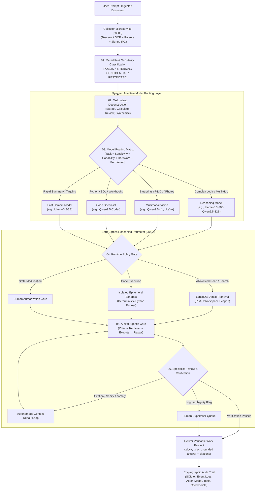

# ORION — Sovereign On-Premise Industrial AI Workbench

> **Private Intelligence Platform for Confidential Industrial, Technical, and Defense Operations**  
> *Zero External Egress · Air-Gap Ready · Open-Weight Multimodal LLMs · Deterministic Verification · Continuous Policy Governance*

[](LICENSE)
[](https://nodejs.org)
[](#security--zero-egress-guarantees)
[](https://app.sooubh.me/orion/index.html)
[](https://app.sooubh.me/orion/architecture.html)
[](https://app.sooubh.me/orion/index.html)

> 🌐 **Live Demonstrations & Technical Specifications:**  
> - **Platform Overview & Operational Workflow:** [https://app.sooubh.me/orion/index.html](https://app.sooubh.me/orion/index.html)  
> - **Technical Architecture & System Specification v2.0:** [https://app.sooubh.me/orion/architecture.html](https://app.sooubh.me/orion/architecture.html)

---

## Table of Contents

- [Executive Summary](#executive-summary)
- [The Foundational Problem & The Operational Gap](#the-foundational-problem--the-operational-gap)
- [Key Architectural Pillars](#key-architectural-pillars)
- [The 6-Step Controlled Execution Lifecycle](#the-6-step-controlled-execution-lifecycle)
- [Macro System Topology](#macro-system-topology)
- [Dynamic Adaptive Model Routing Engine](#dynamic-adaptive-model-routing-engine)
- [Data Classification & Policy Governance](#data-classification--policy-governance)
- [AIbitat Multi-Agent Engine & Ephemeral Sandboxing](#aibitat-multi-agent-engine--ephemeral-sandboxing)
- [Multi-Perspective Review & Deterministic Verification](#multi-perspective-review--deterministic-verification)
- [Hardware Sizing & Deployment Profiles](#hardware-sizing--deployment-profiles)
- [The 7-Point Demonstrable Sovereign Working Proof](#the-7-point-demonstrable-sovereign-working-proof)
- [Industrial Threat Mitigation Matrix](#industrial-threat-mitigation-matrix)
- [Project Structure](#project-structure)
- [Frontend Routes & Navigation](#frontend-routes--navigation)
- [Setup & Installation Guide](#setup--installation-guide)
- [Running the Project](#running-the-project)
- [Automated Verification Test Suite](#automated-verification-test-suite)
- [Environment Configuration](#environment-configuration)
- [Engineering Boundaries & Deployment Truths](#engineering-boundaries--deployment-truths)

---

## Executive Summary

**ORION** is an on-premise, policy-controlled agentic AI workbench and private intelligence platform engineered specifically for confidential industrial, engineering, defense, utility, and regulatory operations.

Industrial organizations routinely work with proprietary technical assets: scanned piping and instrumentation diagrams (P&IDs), engineering blueprints, failure incident logs, equipment maintenance records, SCADA/sensor telemetry, financial audits, internal codebases, and unreleased product designs. Sending these assets to public cloud AI APIs exposes organizations to unacceptable data retention, intellectual property leakage, regulatory non-compliance, and unmonitored agent execution risks.

**ORION establishes a sovereign, air-gap-ready AI perimeter directly on local hardware.** It unites local open-weight multimodal LLMs, embedded vector retrieval, real-time data classification, dynamic model routing, sandboxed tool execution, multi-perspective specialist reviews, and deterministic verification into an auditable enterprise system.

$$\mathbf{Task} + \mathbf{Sensitivity} + \mathbf{Capability} + \mathbf{ACTUAL\ Available\ Models} + \mathbf{ACTUAL\ Hardware} + \mathbf{Permission} \longrightarrow \mathbf{Best\ Eligible\ Model}$$

---

## The Foundational Problem & The Operational Gap

### "Local Model Weights Alone Do Not Equal Enterprise Control"

Hosting an open-weight model (e.g., via Ollama or LM Studio) addresses *where inference compute physically executes*. However, running local weights alone fails to solve the critical operational security challenges that arise when autonomous agents interact with enterprise assets:

1. **Data Clearance:** Which model is authorized to ingest a specific proprietary drawing or classified incident report?
2. **Delegated Authority:** Does the active user hold clearance to authorize the agent to query that specific knowledge base?
3. **Tool Authorization:** Which runtime tools (file writer, shell executor, SQL client, network bridge) may the agent invoke?
4. **Prompt Injection Defense:** How does the system defend against hidden instructions inside ingested vendor PDFs that attempt to hijack agent behavior?
5. **Math & Metric Hallucinations:** How are quantitative calibration formulas and vibration thresholds calculated without relying on probabilistic next-token generation?
6. **Deliverable Verification:** How is a multi-step work product verified for citation grounding and numerical consistency before it is emitted?
7. **Forensic Auditability:** What immutable evidence records which actor, model version, and tool calls produced a given output?

**ORION is engineered around this missing governance layer.** It wraps local inference in an enterprise-grade policy, routing, verification, and audit fabric.

---

## Key Architectural Pillars

| Pillar | Implementation | Sovereign Guarantee |
|:---|:---|:---|
| **Zero-Egress Perimeter** | Local runtimes (Ollama, LM Studio, LocalAI), embedded disk-backed LanceDB, native ONNX embeddings (`Xenova/all-MiniLM-L6-v2`), local Whisper audio transcription, Tesseract.js OCR. | No proprietary context or tokens ever cross external network gateways. |
| **Dynamic Model Routing** | Isolated engine (`server/utils/modelRouting/`) with runtime model discovery, capability auto-inference, and hardware telemetry (CPU, RAM, GPU VRAM). | Dynamically selects the optimal eligible model without static hardcoded model names. |
| **4-Tier Data Classification** | Standard classification service (`server/utils/classification/`) enforcing `PUBLIC`, `INTERNAL`, `CONFIDENTIAL`, and `RESTRICTED` tiers. | Data sensitivity binds immutably to document chunks and runtime context tokens. |
| **Centralized Policy Engine** | Pre-execution governance gate (`server/utils/policy/`) evaluating `User + Data + Model + Tool + Scope -> Allow / Deny / Require Approval`. | Technical capability never supersedes organizational authorization. |
| **Sandboxed Agent Execution** | AIbitat multi-agent core with open Model Context Protocol (MCP) skills and isolated ephemeral code execution. | Mathematical operations run in deterministic sandboxes; state changes require human sign-off. |
| **Deterministic Verification** | Verification manager (`server/utils/verification/`) with math calculation verifiers, structured schema verifiers, RAG citation grounding, and deliverable integrity checks. | Delivers verifiable work products (`.docx`, `.xlsx`, `.pptx`, `.pdf`) with verifiable source backlinks. |
| **Cryptographic Audit Trail** | Structured SQLite event logs recording session actors, accessed files, model checkpoints, tool calls, policy decisions, and verification results. | Complete forensic traceability for regulatory compliance and safety audits. |

---

## The 6-Step Controlled Execution Lifecycle

Rather than streaming unmonitored user prompts to an isolated chatbot, ORION executes every task through a 6-stage controlled pipeline:



### Execution Stages in Detail

1. **Data Classification upon Ingestion:** Incoming documents (PDF, DOCX, XLSX, images, audio) are ingested by the isolated Collector service via RSA-SHA256 signed IPC. Text and metadata are tagged with sensitivity classifications (`PUBLIC`, `INTERNAL`, `CONFIDENTIAL`, `RESTRICTED`) based on organizational patterns, defense markings, and credential scanners.
2. **Task Intent Deconstruction:** The reasoning engine parses user intent, required output schemas (Word, Excel, JSON, Markdown), required modalities (text, vision, code, math), and token budgets before dispatching.
3. **Adaptive Model Routing:** Evaluates `Task + Sensitivity + Capability + Hardware + Permission`. Dynamically checks local runtime model availability and GPU VRAM headroom, matching the workload to the best authorized model. If no local model qualifies, the router **fails closed** (`externalFallbackAllowed: false`).
4. **Pre-Execution Policy & Tool Sandbox Gate:** Before any agent tool runs, the permission gate verifies whether the active user and selected model are authorized to execute that action against that document classification. Read-only RAG queries are scoped by workspace RBAC; code runs in ephemeral sandboxes; state-modifying actions trigger mandatory human sign-off.
5. **AIbitat Resilient Execution Loop:** The agentic core plans and executes steps: `Plan -> Retrieve -> Execute -> Check -> Repair`. Intermediate tool failures trigger localized context recovery without aborting the entire workflow.
6. **Specialist Review & Deterministic Verification:** The specialist review engine (Technical, Policy, Risk, Final Decision) detects conflicts between domain perspectives. In parallel, independent verifiers test mathematical assertions, schema compliance, and document citation back-links against raw source pages.

---

## Macro System Topology

ORION is structured as a decoupled monorepo of three cooperating services:

```mermaid
graph TB
    subgraph "Frontend Client Tier [:3000]"
        UI["React 18 SPA (Vite)"]
        DASH["Command Center Dashboard"]
        CHAT["Workspace Chat (SSE Stream)"]
        REV_UI["AI Review Interface"]
        DELIV_UI["Deliverables Registry"]
        SEC_UI["Security Center & Audit Logs"]
        UI --- DASH & CHAT & REV_UI & DELIV_UI & SEC_UI
    end

    subgraph "Reasoning Server Tier [:3001]"
        API["Express API Gateway"]
        ROUTER["Adaptive Model Router<br/>(Discovery + Telemetry + Scorer)"]
        POLICY["Centralized Policy Engine"]
        AGENTS["AIbitat Agent Engine (MCP)"]
        VERIFY["Deterministic Verification Manager"]
        REVIEW["Specialist Review Engine (4-Pass)"]
        BREE["Bree Job Scheduler (Worker Threads)"]
        PRISMA["Prisma ORM (SQLite / PostgreSQL)"]
        
        API --> ROUTER & POLICY & AGENTS & VERIFY & REVIEW & BREE & PRISMA
    end

    subgraph "Collector Ingestion Tier [:8888]"
        COLL["Express Microservice"]
        PARSERS["Native Parsers (PDF, DOCX, XLSX, etc.)"]
        OCR["Tesseract.js OCR Engine"]
        WHISPER["Local Whisper Audio Transcriber"]
        CONN["Connectors (Git, Confluence, YouTube, etc.)"]
        
        COLL --> PARSERS & OCR & WHISPER & CONN
    end

    subgraph "Local Storage & Persistence"
        SQLITE[("SQLite Database<br/>(30+ Relational Tables)")]
        LANCE[("Embedded LanceDB<br/>(Columnar Arrow Vector Cache)")]
        FS["File System Storage<br/>(storage/documents + storage/generated-files)"]
    end

    UI <-->|"Axios HTTP + SSE<br/>/api/*"| API
    API <-->|"Signed IPC<br/>(RSA-SHA256 + AES-256-CBC)"| COLL
    PRISMA <--> SQLITE
    API <--> LANCE
    API <--> FS
    COLL --> FS
```



### Microservice Responsibilities

- **Frontend (`frontend/`)**: React 18 SPA built with Vite and Tailwind CSS. Features real-time SSE token streaming, markdown rendering with KaTeX math and Highlight.js, interactive Recharts visualizations, dark/light theme, and dedicated workspaces.
- **Server (`server/`)**: Express.js reasoning backend hosting the Adaptive Model Router, Policy Engine, AIbitat Agent Engine, Specialist Review Pipeline, Deterministic Verification Manager, and Bree background worker threads.
- **Collector (`collector/`)**: Isolated document parsing microservice for CPU/memory-intensive tasks (multi-threaded Tesseract.js OCR, Whisper audio transcription, PDF/DOCX/XLSX text extraction). Communicates with the server exclusively via RSA-SHA256 signed, timestamped IPC requests.
- **Storage Tier (`server/storage/`)**: Fully contained on-premise filesystem storage holding the SQLite database (`anythingllm.db`), LanceDB vector indices, cached raw documents, and agent-generated deliverable files.

---

## Dynamic Adaptive Model Routing Engine

Located in [`server/utils/modelRouting/`](file:///d:/Project/orion/server/utils/modelRouting/), this module eliminates static, hardcoded model dependencies. It dynamically discovers and scores models based on real-time runtime status and hardware availability:

```
Task Intent + Data Sensitivity + Capability Needs + ACTUAL Runtime Models + ACTUAL Hardware VRAM + Permissions
                                      │
                                      ▼
                   Stage A: Hard Constraint Filtering
                   (Clearance, Modality, Hardware Feasibility)
                                      │
                                      ▼
                   Stage B: Multi-Attribute Suitability Scoring
                   (Task Fit 30%, Cap Fit 25%, Sens Fit 20%, HW Fit 15%, Ctx 5%, Prio 5%)
                                      │
                                      ▼
                             Best Eligible Model
                     (Fail-Closed: Zero External Fallback)
```

### Engine Submodules

- **Dynamic Discovery ([`discovery/ModelDiscovery.js`](file:///d:/Project/orion/server/utils/modelRouting/discovery/ModelDiscovery.js))**: Connects to local runtimes (Ollama API, LM Studio / LocalAI `/v1/models`), discovers active models, and automatically infers capabilities (`vision`, `code`, `reasoning`, `toolUse`), context windows, parameter tiers, and estimated RAM/VRAM footprints. Also loads user-defined metadata overrides from `storage/models/model-profiles.json`.
- **Dynamic Registry ([`registry/ModelRegistry.js`](file:///d:/Project/orion/server/utils/modelRouting/registry/ModelRegistry.js))**: Singleton registry maintaining available models; supports dynamic `register()`, `unregister()`, and live `refreshFromRuntime()`.
- **Hardware Profiler ([`profiler/HardwareProfiler.js`](file:///d:/Project/orion/server/utils/modelRouting/profiler/HardwareProfiler.js))**: Probes host CPU cores, free RAM, and GPU VRAM (via non-blocking `nvidia-smi` queries, Apple Silicon Metal unified memory inspection, or OS memory fallbacks) with a 300s cache TTL. Evaluates physical feasibility (`isHardwareFeasible`) and headroom scores.
- **Task Classifier ([`classifier/TaskClassifier.js`](file:///d:/Project/orion/server/utils/modelRouting/classifier/TaskClassifier.js))**: Deterministic sub-millisecond regex and keyword taxonomy classifier that detects modality requirements (vision attachments, code snippets, tool calls, token budgets) without external LLM latency.
- **Candidate Filter ([`filter/CandidateFilter.js`](file:///d:/Project/orion/server/utils/modelRouting/filter/CandidateFilter.js))**: Enforces non-negotiable Stage A gates: administrative approval, role access, sensitivity clearance, modality capability, and hardware feasibility.
- **Suitability Scorer ([`scorer/RoutingScorer.js`](file:///d:/Project/orion/server/utils/modelRouting/scorer/RoutingScorer.js))**: Computes normalized suitability scores across Task Fit (30%), Capability Fit (25%), Sensitivity Clearance (20%), Hardware Fit (15%), Context Window Fit (5%), and Priority (5%).
- **Privacy Audit Logger ([`audit/RoutingAuditor.js`](file:///d:/Project/orion/server/utils/modelRouting/audit/RoutingAuditor.js))**: Quarantines confidential data by logging decision IDs, model IDs, scores, and hardware summaries while strictly omitting raw prompts, document texts, and credentials.

---

## Data Classification & Policy Governance

ORION treats data classification as a first-class citizen across storage and execution:

| Classification | Sensitivity Weight | Target Documents | Routing & Tool Governance Rules |
|:---|:---:|:---|:---|
| **PUBLIC** | 0 | Public brochures, published specs, open docs. | Permitted across all approved local and hybrid providers. External tools allowed. |
| **INTERNAL** | 1 | Internal memos, standard operating procedures, team docs. | Routed to local models or approved internal endpoints. Web browsing requires approval. |
| **CONFIDENTIAL** | 2 | Financial records, unreleased designs, vendor contracts, P&IDs. | **Strictly local execution.** External cloud providers blocked. Ephemeral sandboxed tools only. |
| **RESTRICTED** | 3 | Defense assets, ITAR-controlled drawings, cryptographic keys, root credentials. | **Maximum sovereign isolation.** Deny-by-default network. Only air-gap cleared models permitted. State changes require multi-party sign-off. |

The centralized Policy Engine ([`server/utils/policy/index.js`](file:///d:/Project/orion/server/utils/policy/index.js)) enforces these boundaries dynamically at runtime:
$$\text{EvaluatePolicy}(\text{User}, \text{Classification}, \text{Model}, \text{Tool}, \text{Action}) \longrightarrow \{\text{ALLOW},\ \text{DENY},\ \text{REQUIRE\_APPROVAL}\}$$

---

## AIbitat Multi-Agent Engine & Ephemeral Sandboxing

ORION incorporates the **AIbitat** multi-agent framework, extended with the open **Model Context Protocol (MCP)** standard:

- **Mathematical Integrity via Sandboxed Python:** When an agent encounters numerical computations (equipment efficiency curves, tolerance limits, financial sums), it writes a Python script and executes it within a sandboxed child process. The verified numerical output is inserted back into the response, preventing token-generation hallucinations.
- **MCP-Standardized Skill Tooling:** External skills adhere to the open MCP protocol, providing typed JSON-RPC schemas, strict parameter validation, and explicit capability boundaries.
- **Pre-Execution Permission Gating:** Read queries against the vector store are strictly scoped to the user's workspace role. Any state-modifying action (file deletion, database record mutation, external transmission) triggers an interactive human-in-the-loop authorization prompt before execution proceeds.

---

## Multi-Perspective Review & Deterministic Verification

ORION separates creative generation from verification:

### 1. Specialist AI Review Engine (`server/endpoints/review.js`)

Evaluates task outputs through four independent lenses:
- **Technical Specialist:** Audits system architecture, API specifications, and mechanical/engineering parameters.
- **Policy & SOP Specialist:** Audits compliance against internal operating guidelines, data retention limits, and safety standards.
- **Risk Assessment Specialist:** Identifies single points of failure, security vulnerabilities, and operational hazards.
- **Conflict Detector & Synthesizer:** Detects contradictions between specialist findings and compiles a synthesized, actionable final decision note.

### 2. Deterministic Verification Engine (`server/utils/verification/`)

Independent of probabilistic LLM inference, deterministic verifiers check output integrity:
- **`CalculationVerifier`:** Re-evaluates mathematical expressions with epsilon tolerance checks.
- **`StructuredOutputVerifier`:** Validates JSON/schema compliance and required fields.
- **`RAGGroundingVerifier`:** Validates citation backlinks, verifying that claimed assertions exist within retrieved source passages.
- **`DeliverableVerifier`:** Inspects generated `.docx`, `.xlsx`, `.pptx`, and `.pdf` files for structural integrity, valid headers, and file corruption before user download.
- **`RepairEngine`:** Automatically triggers targeted context repairs when verification flags minor discrepancies.

---

## Hardware Sizing & Deployment Profiles

ORION scales across diverse industrial compute environments using open-weight quantized models:

| Profile | Target Hardware Specification | Supported Model Tiers | Recommended Operational Role |
|:---|:---|:---|:---|
| **Edge / Workstation** | 1x NVIDIA RTX 3060 / 4070 (12GB VRAM) or Apple Silicon (16GB–32GB Unified Memory). 8-core CPU, 32GB RAM. | 7B–8B parameter models (Q4_K_M quantization), native ONNX embeddings (`all-MiniLM-L6-v2`), embedded LanceDB. | Field maintenance stations, remote site offices, standalone inspection kiosks. |
| **Department Server** | 1x–2x NVIDIA RTX 3090 / 4090 (24GB–48GB VRAM) or RTX A5000. 16-core CPU, 64GB–128GB RAM, NVMe storage. | 14B–32B parameter models (Qwen2.5-Coder:32B, Qwen2.5-VL), concurrent workspace RAG chats, background Bree workers. | Plant engineering departments, technical drawing analysis teams, internal corporate divisions. |
| **Air-Gapped Enterprise** | Dual Xeon / EPYC rack server, 2x–4x NVIDIA A100 / H100 (80GB VRAM) or L40S cluster. 256GB+ ECC RAM, redundant NVMe arrays. | 70B+ parameter foundation models (Llama-3.3-70B, DeepSeek-V3), high-throughput batch document OCR, site-wide multi-agent workflows. | Defense installations, corporate intelligence hubs, sovereign government and utility networks. |

---

## The 7-Point Demonstrable Sovereign Working Proof

Sovereignty is established through empirical verification rather than passive claims:

| # | Proof Criterion | Expected Operational Behavior | Empirical Verification Method |
|:---:|:---|:---|:---|
| **1** | **Confidential Data Stays Local** | Ingested files, vector indices, and chat transcripts remain strictly on the host filesystem. | Inspect `server/storage/documents` and `server/storage/lancedb`; monitor network interfaces (`netstat -ano`) to confirm zero non-localhost connections. |
| **2** | **Automatic Data Classification** | The ingestion service categorizes documents with sensitivity labels upon upload. | Inspect SQLite table `workspace_documents` for assigned metadata classifications (`PUBLIC`, `INTERNAL`, `CONFIDENTIAL`, `RESTRICTED`). |
| **3** | **Context-Aware Model Routing** | Tasks are dynamically dispatched to optimal local models matching capability, VRAM, and clearance. | Review Model Router logs confirming task-to-model allocation and fail-closed behavior when requirements cannot be met. |
| **4** | **Pre-Execution Tool Authorization** | Runtime permission gates verify user, document, and tool clearance prior to execution. | Trigger an unauthorized tool action; verify immediate block event (403 Forbidden) in audit logs. |
| **5** | **Multi-Step Agent Workflow** | Executes multi-turn plans (extraction &rarr; synthesis &rarr; sandboxed compute) with automated recovery. | Inspect AIbitat multi-step execution logs and autonomous error-repair loops. |
| **6** | **Verifiable Work Product** | Delivers structured deliverables (Word, Excel, grounded answers) with direct source citations. | Validate citation backlinks linking text assertions directly to source page numbers and paragraph sections. |
| **7** | **Network Audit Verification** | Network logs confirm zero unauthorized outbound calls occurred during the entire run. | Run network packet capture (Wireshark or OS socket audits) during workflow execution to verify zero egress. |

---

## Industrial Threat Mitigation Matrix

| Threat Vector | Industrial Risk Scenario | ORION Architectural Mitigation |
|:---|:---|:---|
| **Indirect Prompt Injection** | Malicious hidden instructions in vendor PDFs instruct agent to leak documents or delete data. | Strict parser sanitization in Collector microservice; tool permission gates require human approval for state changes; code runs in isolated sandboxes. |
| **Context Data Contamination** | Classified plant blueprint context accidentally exposed to lower-clearance users during multi-turn chat. | Workspace boundary enforcement and RBAC metadata filtering in LanceDB vector similarity search; context tokens inherit document sensitivity. |
| **Hallucinated Technical Metrics** | Model invents engineering parameters, causing faulty equipment calibration or hazardous calculations. | Analytical computations delegated to sandboxed Python rather than model token generation; Specialist Review cross-checks citations against source text. |
| **Silent Network Telemetry** | Dependencies or model libraries emit telemetry beacons or crash reports to external servers. | Deny-by-default network policies; remote telemetry endpoints eliminated from codebase; signed RSA-SHA256 IPC used exclusively for internal services. |

---

## Project Structure

```
orion/
├── architecture.html                      # Technical Architecture Specification (Interactive)
├── index.html                             # Sovereign Workbench Presentation & System Overview
├── package.json                           # Root monorepo scripts (dev, setup, test:router)
├── spec/
│   └── ORION_Adaptive_Model_Routing_Integration_Plan.md  # Adaptive Routing Architecture Spec
├── collector/                             # Document Ingestion Microservice (:8888)
│   ├── index.js                           # Express entry point
│   ├── processSingleFile/                 # Document converters (PDF, DOCX, XLSX, etc.)
│   ├── convertAudioToWav/                 # FFmpeg audio conversion
│   ├── utils/
│   │   ├── OCRLoader/                     # Multi-threaded Tesseract.js OCR
│   │   ├── WhisperProviders/              # Local Whisper audio transcription
│   │   ├── comKey/                        # RSA-SHA256 IPC signature verification
│   │   └── EncryptionWorker/              # Credential encryption
│   └── package.json
├── server/                                # Application & Reasoning Server (:3001)
│   ├── index.js                           # Express entry point
│   ├── __tests__/
│   │   └── adaptiveRouting.test.js        # Dynamic routing & capability verification tests
│   ├── endpoints/
│   │   ├── system.js                      # System onboarding, branding, settings
│   │   ├── workspaces.js                  # Workspace CRUD & embeddings
│   │   ├── chat.js                        # Real-time SSE streaming chat
│   │   ├── review.js                      # Specialist AI Review Engine (4-Pass)
│   │   ├── deliverables.js                # Generated file registry & verifier
│   │   ├── security.js                    # Security Center status, hardware vitals, audit logs
│   │   ├── modelRouter.js                 # Workspace model routing API
│   │   ├── agentFlows.js                  # Visual agent flow builder
│   │   └── mcpServers.js                  # Model Context Protocol server manager
│   ├── models/                            # Prisma model wrappers (users, workspaces, chats, etc.)
│   ├── prisma/
│   │   ├── schema.prisma                  # Database schema (30+ relational tables)
│   │   └── migrations/                    # SQLite/PostgreSQL migrations
│   ├── jobs/                              # Bree background worker threads
│   │   ├── embedding-worker.js            # Async vector embedding queue
│   │   ├── extract-memories.js            # Workspace memory extraction
│   │   └── run-scheduled-job.js           # Cron-based agent job runner
│   ├── utils/
│   │   ├── modelRouting/                  # Dynamic Adaptive Model Routing Engine
│   │   │   ├── discovery/                 # Local model runtime discovery (Ollama/LM Studio)
│   │   │   ├── registry/                  # Model registry singleton & config loader
│   │   │   ├── profiler/                  # Hardware telemetry (CPU, RAM, GPU VRAM)
│   │   │   ├── classifier/                # Sub-millisecond task intent taxonomy
│   │   │   ├── filter/                    # Stage A hard constraint filtering
│   │   │   ├── scorer/                    # Stage B multi-attribute suitability scoring
│   │   │   ├── audit/                     # Zero-leak privacy audit logger
│   │   │   └── adapter/                   # Context adapter & sensitivity aggregator
│   │   ├── classification/                # 4-Tier Data Classification Service
│   │   ├── policy/                        # Centralized Policy Governance Engine
│   │   ├── verification/                  # Deterministic Verification & Repair Engine
│   │   ├── agents/                        # AIbitat agent engine & MCP tool skills
│   │   ├── vectorDbProviders/             # LanceDB (default), Chroma, Qdrant, etc.
│   │   ├── EmbeddingEngines/              # Native ONNX (all-MiniLM-L6-v2), Ollama, etc.
│   │   └── AiProviders/                   # Ollama, LM Studio, LocalAI, and hybrid connectors
│   └── storage/                           # Persistent local storage (DB, vectors, files)
└── frontend/                              # React 18 Single-Page Application (:3000)
    ├── index.html                         # Vite HTML template
    ├── vite.config.js                     # Vite build configuration
    └── src/
        ├── App.jsx                        # Root application component
        ├── main.jsx                       # Client routing & lazy-loaded pages
        ├── pages/
        │   ├── Dashboard/                 # Sovereign AI Command Center
        │   ├── WorkspaceChat/             # Streaming chat with citations & charts
        │   ├── Documents/                 # Document repository & workspace embedding
        │   ├── Knowledge/                 # Vector database & semantic search explorer
        │   ├── Review/                    # Multi-perspective specialist AI review
        │   ├── Deliverables/              # Generated files registry
        │   ├── Security/                  # Security Center & audit log viewer
        │   └── Admin/                     # User, agent, and system settings
        └── components/                    # Reusable UI component library
```

---

## Frontend Routes & Navigation

| Route | Page | Access Level | Purpose |
|:---|:---|:---|:---|
| `/` or `/dashboard` | **Dashboard** | Private | Sovereign Command Center — system status, workspace overview, zero-egress metrics. |
| `/workspace/:slug` | **WorkspaceChat** | Private | Grounded RAG chat interface with real-time SSE streaming and citation backlinks. |
| `/workspace/:slug/t/:threadSlug` | **WorkspaceChat** | Private | Multi-threaded workspace conversations. |
| `/workspace/:slug/settings/:tab` | **WorkspaceSettings** | Manager | Workspace configuration (appearance, vector DB, members, agent skills). |
| `/documents` | **Documents** | Private | Document repository — upload, classification inspection, workspace embedding. |
| `/knowledge` | **Knowledge** | Private | Vector DB explorer — semantic retrieval testing and similarity score auditing. |
| `/review` or `/ai-review` | **Review** | Private | 4-Domain Specialist AI Review (Technical, Policy, Risk, Final Decision). |
| `/deliverables` | **Deliverables** | Private | Registry of generated files (`.docx`, `.xlsx`, `.pptx`, `.pdf`, code) with verification status. |
| `/security` | **Security** | Private | Security Center — hardware vitals, memory footprint, encryption status, audit logs. |
| `/settings/*` | **Settings** | Admin / Manager | System administration, LLM preferences, MCP servers, and access policies. |

---

## Setup & Installation Guide

### Prerequisites

- **Node.js** ≥ 18.12.1 (LTS recommended)
- **npm** or **yarn**
- **Git**
- **Local Model Runner:** [Ollama](https://ollama.com/) (recommended) or [LM Studio](https://lmstudio.ai/) running locally on the host machine.
  ```bash
  # Example: Pull standard local models with Ollama
  ollama pull llama3.1:8b
  ollama pull qwen2.5-coder:7b
  ```
- *Optional:* Chromium (for Puppeteer web crawling), FFmpeg (for local audio conversion).

### 1. Clone the Repository

```bash
git clone https://github.com/sooubh/orion.git
cd orion
```

### 2. Install Dependencies

Install all root, server, collector, and frontend dependencies:

```bash
# Install root dependencies
npm install

# Install sub-service dependencies
cd server && npm install && cd ..
cd collector && npm install && cd ..
cd frontend && npm install && cd ..
```

### 3. Initialize the Database

Generate the Prisma client and apply the SQLite migrations:

```bash
npm run setup
```

### 4. Configure Environment Variables

Create your local environment files from the provided examples:

```bash
cp server/.env.example server/.env
cp collector/.env.example collector/.env
```

Review and adjust `server/.env` as necessary. For standard sovereign local execution, default settings use:
- `LLM_PROVIDER=ollama`
- `EMBEDDING_ENGINE=native` (uses local ONNX `all-MiniLM-L6-v2`)
- `VECTOR_DB=lancedb` (uses embedded disk-backed LanceDB)
- `ADAPTIVE_ROUTING_ENABLED=true`

---

## Running the Project

### Unified Launch (All 3 Services)

Launch the Frontend (`:3000`), Reasoning Server (`:3001`), and Collector (`:8888`) concurrently with a single command:

```bash
npm run dev
```

Once started:
- Access the **Frontend UI** at: `http://localhost:3000`
- Access the **Architecture Specification** at: `http://localhost:3000/architecture.html`
- Access the **Reasoning API** at: `http://localhost:3001`
- Access the **Ingestion Collector** at: `http://localhost:8888`

### Individual Service Launch

```bash
npm run dev:server      # Server only (runs nodemon on :3001)
npm run dev:collector   # Collector only (runs nodemon on :8888)
npm run dev:frontend    # Frontend only (runs Vite dev server on :3000)
```

### Production Build

```bash
npm run build:frontend  # Compiles Vite frontend into frontend/dist/
cd server && npm start  # Starts production Express server (serves frontend from public/)
```

---

## Automated Verification Test Suite

The Adaptive Model Routing engine and integration connectors include an automated test suite verifying capability-based routing, hardware feasibility, sensitivity clearance, and fail-closed behavior:

```bash
# Run test suite from root
npm run test:router

# Or run directly from server
cd server && npm run test:router
```

### Verified Test Cases

```text
✔ Test 1  — Text summary on internal data routes to an eligible text-capable model
✔ Test 2  — Code review task strictly selects an eligible code-capable model
✔ Test 3  — Scanned document with vision requirement routes to approved vision model
✔ Test 4  — Model explicitly denied by permission policy is excluded from selection
✔ Test 5  — Model requiring more VRAM than available is excluded to prevent OOM
✔ Test 6  — Restricted data excludes models that only support Public/Internal
✔ Test 7  — When no model meets requirements, router fails closed (zero external fallback)
✔ Test 8  — Administratively disabled model is never selected
✔ Test 9  — Identical routing contexts yield deterministic decisions across 20 iterations
✔ Test 10 — Standard workspaces without routing remain unaffected (backward compatibility)
✔ Test 11 — Adding and removing local models dynamically changes selection without code changes
✔ Test 12 — ModelDiscovery auto-infers capabilities, VRAM, and context window from metadata
✔ Test 13 — resolveProviderConnector returns unrouted connector for legacy workspaces
✔ Test 14 — resolveProviderConnector dynamically routes when chatProvider is 'adaptive-router'
```

---

## Environment Configuration

### Server (`server/.env`)

| Variable | Default | Purpose |
|:---|:---|:---|
| `SERVER_PORT` | `3001` | Express reasoning server port. |
| `JWT_SECRET` | *(Generated)* | Secret used to sign user session tokens. |
| `SIG_KEY` | *(Generated)* | Secret passphrase for RSA-SHA256 IPC signing. |
| `SIG_SALT` | *(Generated)* | Salt used for inter-service IPC verification. |
| `STORAGE_DIR` | `server/storage` | Path to persistent local data directory. |
| `ADAPTIVE_ROUTING_ENABLED` | `true` | Enables dynamic task, sensitivity, and hardware model routing. |
| `LLM_PROVIDER` | `ollama` | Default primary LLM provider (`ollama`, `lmstudio`, `localai`, etc.). |
| `EMBEDDING_ENGINE` | `native` | Embedding provider (`native` ONNX model, `ollama`, etc.). |
| `VECTOR_DB` | `lancedb` | Vector database provider (`lancedb`, `chroma`, etc.). |
| `WHISPER_PROVIDER` | `local` | Audio transcription provider (`local` Xenova Whisper). |
| `TTS_PROVIDER` | `native` | Text-to-speech provider (`native` Piper ONNX). |

### Collector (`collector/.env`)

| Variable | Default | Purpose |
|:---|:---|:---|
| `COLLECTOR_PORT` | `8888` | Ingestion microservice port. |

---

## Engineering Boundaries & Deployment Truths

To maintain truth in engineering and operational integrity, ORION adheres to transparent boundaries:

1. **Deterministic Security over Absolute Claims:** ORION eliminates external data exposure through local computation, strict network policies, signed inter-service IPC, and dynamic tool gating. Air-gap integrity requires corresponding host OS firewall and socket-level enforcement in accordance with facility policies.
2. **Local Hardware Headroom:** Local open-weight models require sufficient physical RAM and GPU VRAM. Running multi-billion parameter models on hardware without appropriate memory will result in slow CPU quantization fallback or process termination. Consult the [Hardware Sizing Profiles](#hardware-sizing--deployment-profiles) for target allocations.
3. **Database Concurrency:** ORION ships with embedded **SQLite via Prisma ORM** by default, ideal for single-node air-gapped workstations and department servers. For high-concurrency enterprise deployments with hundreds of simultaneous operators, the Prisma schema can be mapped to an internal on-premise PostgreSQL cluster.
4. **Strict Sovereign Local Extensibility:** ORION is engineered for 100% on-premise air-gapped sovereignty. For organizations running custom internal LLMs, ORION connects seamlessly to any self-hosted, OpenAI-compatible local runtime (vLLM, TGI, Ollama, LM Studio, or LocalAI) within the internal network perimeter without requiring external cloud access or data egress.

---

## License

ORION is open-source software licensed under the [MIT License](LICENSE).
